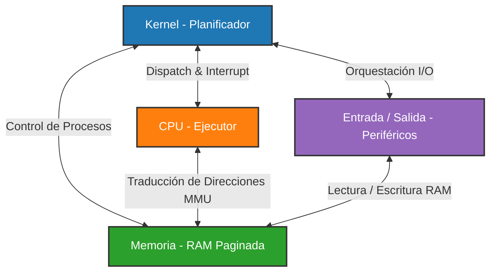

# 💻 SimOS: Simulador de Sistema Operativo Multiprocesamiento
Trabajo Práctico de Sistemas Operativos - UTN FRBA (1C 2024)

---

## 📝 Descripción General

**SimOS** es un sistema distribuido que simula la arquitectura y el comportamiento de un **Sistema Operativo multiprocesamiento**. El diseño está compuesto por **4 módulos desacoplados** que interactúan entre sí a través de sockets TCP (`so-commons-library`), además de un módulo estático compartido (`utils`) que provee estructuras de datos comunes, serialización y utilidades de red.

El simulador implementa desde la planificación avanzada de procesos y la gestión de memoria paginada con traducción por hardware (MMU y TLB), hasta la ejecución de un ciclo de instrucción completo y la simulación de periféricos de Entrada/Salida con un sistema de archivos contiguo de disco (DialFS) autocompactable.

---

## 🏗️ Arquitectura del Sistema

La arquitectura está inspirada en sistemas distribuidos compuestos por microservicios, donde cada módulo representa una capa física de hardware/kernel:



### 📦 Componentes y Módulos

#### 1. 🧠 Kernel (Orquestador de Procesos)
Es el "cerebro" del sistema operativo. Controla el ciclo de vida de los procesos (PCBs) a través de sus transiciones de estado: `NEW`, `READY`, `EXEC`, `BLOCKED`, `EXIT`.
*   **Planificación a Largo Plazo:** Administra el grado de multiprogramación del sistema controlando el paso de procesos de `NEW` a `READY` y liberando recursos al finalizar procesos.
*   **Planificación a Corto Plazo:** Soporta tres algoritmos de planificación configurables dinámicamente:
    *   **FIFO (First-In, First-Out):** Planificación no cooperativa y simple por orden de llegada.
    *   **RR (Round Robin):** Planificación basada en ráfagas de tiempo asignadas a los procesos (Quantum).
    *   **VRR (Virtual Round Robin):** Algoritmo optimizado que prioriza los procesos bloqueados por I/O que regresan con remanente de quantum sin consumir, colocándolos en una cola auxiliar de alta prioridad (`READY Prioridad`).
*   **Gestión de Recursos:** Maneja semáforos virtuales para sincronización, resolviendo bloqueos ante solicitudes `WAIT` e interbloqueos ante señales `SIGNAL`.
*   **Consola Interactiva:** CLI que permite al usuario interactuar en tiempo real con el estado de la simulación.

#### 2. ⚡ CPU (Unidad de Procesamiento)
Simula el procesador físico de la computadora. Ejecuta las instrucciones del proceso en ejecución enviado por el Kernel.
*   **Ciclo de Instrucción:** Ejecuta secuencialmente las etapas de:
    1.  **Fetch:** Solicita la instrucción en formato string a la Memoria utilizando el Program Counter (`PC`).
    2.  **Decode:** Identifica el código de operación, los operandos y el tamaño del registro a operar.
    3.  **Execute:** Ejecuta la lógica correspondiente de lectura, escritura o control.
    4.  **Check Interrupt:** Comprueba si el Kernel ha enviado una señal de desalojo (fin de quantum, interrupción manual, etc.).
*   **Registros de CPU:**
    *   Registros de 1 byte: `AX`, `BX`, `CX`, `DX`
    *   Registros de 4 bytes: `EAX`, `EBX`, `ECX`, `EDX`, `PC` (Program Counter), `SI` (Source Index), `DI` (Destination Index)
*   **MMU & TLB:**
    *   Cuenta con una **MMU** encargada de traducir direcciones lógicas de memoria en direcciones físicas usando paginación simple.
    *   Incorpora una **TLB** (Translation Lookaside Buffer) configurable para acelerar la traducción. Si ocurre un *TLB Hit*, la dirección física se obtiene directamente. Si hay un *TLB Miss*, consulta a Memoria y actualiza su estructura interna usando algoritmos de reemplazo **FIFO** o **LRU**.

#### 3. 💾 Memoria (RAM Simulada)
Emula el almacenamiento primario del sistema.
*   **Paginación:** Divide el espacio de usuario disponible en páginas de tamaño uniforme (`TAM_PAGINA`). Administra tablas de páginas y marcos libres mediante un vector de bits (*bitmap*).
*   **Control Dinámico:** Ofrece la capacidad de redimensionar el espacio de usuario de los procesos (`RESIZE`), ampliando o reduciendo páginas asignadas según el espacio requerido. Si no hay marcos suficientes, reporta error `OUT_OF_MEMORY`.
*   **Retardo Configurable:** Simula accesos físicos reales aplicando un delay artificial de espera (`RETARDO_RESPUESTA`) ante operaciones de lectura y escritura.

#### 4. 🔌 Entrada / Salida (Interfaces y Periféricos)
Administra la comunicación de periféricos virtuales encargados de interactuar con el entorno. Se configuran de manera independiente mediante archivos `.config` y admiten 4 tipos de comportamiento:
*   **GENERICA (GEN):** Emula un periférico simple aplicando un retardo basado en unidades de trabajo multiplicado por el tiempo configurado (`TIEMPO_UNIDAD_TRABAJO`).
*   **STDIN (Teclado):** Solicita texto por la consola del dispositivo y lo escribe directamente en la memoria del proceso (en las direcciones físicas traducidas por la CPU).
*   **STDOUT (Pantalla):** Lee el contenido almacenado en la memoria física del proceso y lo imprime en pantalla de forma legible.
*   **DIALFS (Sistema de Archivos):** Implementa un File System de asignación contigua en un disco virtual. Cuenta con un bitmap para gestionar bloques libres y bloques FCB (File Control Block) para metadatos del archivo.
    *   Operaciones: Creación, eliminación, truncado y lectura/escritura física.
    *   **Autocompactación:** Ante un truncado que requiera bloques adicionales dispersos, DialFS inicia una compactación de datos contiguos de disco para agrupar los bloques vacíos remanentes.

#### 5. 🛠️ Utils (Biblioteca Compartida)
Capa estática transversal que provee:
*   Protocolo estructurado de comunicación mediante serialización y empaquetado de sockets.
*   Clases genéricas para mensajería de red y códigos de operación (`op_code`).
*   Configuraciones base compartidas y lógica auxiliar para manejo seguro de punteros.

---

## 📋 Set de Instrucciones de CPU

El ciclo de ejecución en la CPU procesa el siguiente lenguaje simulado estructurado en instrucciones elementales:

| Instrucción | Parámetros | Descripción |
| :--- | :--- | :--- |
| **SET** | `Registro`, `Valor` | Asigna el valor especificado al registro indicado. |
| **SUM** | `Destino`, `Origen` | Suma el contenido de `Origen` al valor del registro `Destino`. |
| **SUB** | `Destino`, `Origen` | Resta el contenido de `Origen` al valor del registro `Destino`. |
| **JNZ** | `Registro`, `Nro_Instrucción` | Bifurcación condicional: Si el valor de `Registro` no es cero, actualiza el `PC` a la instrucción especificada. |
| **RESIZE** | `Tamaño` | Solicita a Memoria ajustar dinámicamente el tamaño del proceso en bytes. |
| **MOV_IN** | `Reg_Datos`, `Dir_Lógica` | Lee el valor contenido en la dirección lógica de memoria y lo escribe en `Reg_Datos`. |
| **MOV_OUT** | `Dir_Lógica`, `Reg_Datos` | Escribe el valor contenido en `Reg_Datos` en la dirección lógica de memoria indicada. |
| **COPY_STRING** | `Tamaño` | Copia una secuencia de caracteres de longitud `Tamaño` desde la dirección física en `SI` a la dirección física en `DI`. |
| **WAIT** | `Recurso` | Solicita una instancia de `Recurso` al Kernel. Bloquea el proceso si no hay instancias libres. |
| **SIGNAL** | `Recurso` | Libera una instancia de `Recurso`, despertando al primer proceso de la cola de espera de ese recurso. |
| **IO_GEN_SLEEP** | `Interfaz`, `Unidades` | Solicita una operación de espera genérica a la interfaz de I/O por una duración dada. |
| **IO_STDIN_READ**| `Interfaz`, `Dir_Lógica`, `Reg_Tamaño` | Lee texto ingresado por el teclado de la interfaz `Interfaz` y lo guarda en memoria. |
| **IO_STDOUT_WRITE**| `Interfaz`, `Dir_Lógica`, `Reg_Tamaño`| Toma el valor de memoria y lo imprime en pantalla a través de la interfaz `Interfaz`. |
| **IO_FS_CREATE** | `Interfaz`, `Archivo` | Crea un archivo en el sistema de archivos DialFS manejado por `Interfaz`. |
| **IO_FS_DELETE** | `Interfaz`, `Archivo` | Elimina un archivo en DialFS y libera los bloques ocupados en el disco virtual. |
| **IO_FS_TRUNCATE**| `Interfaz`, `Archivo`, `Reg_Tamaño` | Ajusta el tamaño de `Archivo` en DialFS. Desata compactación de disco si es necesario. |
| **IO_FS_WRITE** | `Interfaz`, `Arch`, `Dir_Log`, `Reg_Tam`, `Reg_Punt` | Escribe datos de memoria en el bloque indicado por el puntero de archivo. |
| **IO_FS_READ** | `Interfaz`, `Arch`, `Dir_Log`, `Reg_Tam`, `Reg_Punt` | Lee datos de un bloque del archivo y los guarda en la memoria del proceso. |
| **EXIT** | - | Finaliza con éxito la ejecución del proceso. |

---

## 🖥️ Comandos de la Consola del Kernel

La consola del Kernel permite administrar de manera interactiva la simulación del sistema operativo con los siguientes comandos:

| Comando | Sintaxis | Descripción |
| :--- | :--- | :--- |
| **EJECUTAR_SCRIPT** | `EJECUTAR_SCRIPT [Ruta_Relativa]` | Lee y ejecuta de forma secuencial un script con una serie de comandos de consola. |
| **INICIAR_PROCESO** | `INICIAR_PROCESO [Ruta_Archivo]` | Crea un nuevo PCB para el proceso y lo ingresa en el estado `NEW` especificando el path de instrucciones. |
| **FINALIZAR_PROCESO** | `FINALIZAR_PROCESO [PID]` | Fuerza la terminación del proceso indicado, moviéndolo al estado `EXIT` y liberando recursos/páginas. |
| **DETENER_PLANIFICACION** | `DETENER_PLANIFICACION` | Pausa temporalmente la planificación a corto y largo plazo del Kernel. |
| **INICIAR_PLANIFICACION** | `INICIAR_PLANIFICACION` | Reanuda la planificación suspendida de procesos en los diferentes estados. |
| **MULTIPROGRAMACION** | `MULTIPROGRAMACION [Valor]` | Ajusta dinámicamente en tiempo real el grado de multiprogramación permitido por el Kernel. |
| **PROCESO_ESTADO** | `PROCESO_ESTADO` | Muestra en pantalla el listado detallado de todos los PIDs clasificados por estado de transición. |
| **RECURSOS** | `RECURSOS` | Muestra el estado actual y las instancias disponibles de los recursos del sistema. |
| **GRADO_MULTIPROGRAMACION**| `GRADO_MULTIPROGRAMACION` | Consulta los grados actuales reales y auxiliares de multiprogramación. |

---

## 🛠️ Instalación y Compilación

### Requisitos Previos

Es obligatorio contar con la biblioteca **so-commons-library** de la cátedra previamente compilada e instalada en el sistema local:

```bash
git clone https://github.com/sisoputnfrba/so-commons-library
cd so-commons-library
make debug
sudo make install
```

### Compilación del Proyecto

Cada módulo posee un archivo `makefile` independiente. Para compilar cada uno de ellos, ingresa a su directorio raíz y ejecuta `make`:

```bash
# Compilar modulo CPU
cd cpu
make clean && make

# Compilar modulo Memoria
cd ../memoria
make clean && make

# Compilar modulo Kernel
cd ../kernel
make clean && make

# Compilar modulo EntradaSalida
cd ../entradasalida
make clean && make
```

Los ejecutables generados se compilarán en la respectiva carpeta `/bin` de cada módulo.

---

## 🚀 Guía de Ejecución

Para iniciar la simulación completa, deben iniciarse los componentes en un orden lógico para establecer los sockets de comunicación:

1.  **Iniciar Memoria:** Debe estar lista para recibir conexiones de CPU, Kernel e I/O.
    ```bash
    ./memoria/bin/memoria
    ```
2.  **Iniciar CPU:** Establece conexiones directas con Memoria y espera la conexión del Kernel en los puertos Dispatch e Interrupt.
    ```bash
    ./cpu/bin/cpu
    ```
3.  **Iniciar Kernel:** Se conecta a Memoria, CPU y levanta el servidor de escucha para interfaces I/O. Lanza la consola interactiva.
    ```bash
    ./kernel/bin/kernel
    ```
4.  **Iniciar Interfaces de Entrada/Salida:** Cada periférico se puede levantar de forma independiente especificando un nombre descriptivo y su correspondiente configuración:
    ```bash
    ./entradasalida/bin/entradasalida [Nombre_Interfaz] [Ruta_Configuración]
    
    # Ejemplos de uso:
    ./entradasalida/bin/entradasalida SLP1 entradasalida/configuraciones/SLP1.config
    ./entradasalida/bin/entradasalida TECLADO entradasalida/configuraciones/stdin.config
    ./entradasalida/bin/entradasalida PANTALLA entradasalida/configuraciones/stdout.config
    ./entradasalida/bin/entradasalida DIALFS entradasalida/configuraciones/FS.config
    ```

---

## 🔍 Análisis de Memoria y Debugging (Valgrind)

Cada makefile del proyecto incluye accesos directos configurados para correr análisis y diagnósticos utilizando **Valgrind**:

*   **Verificación de fugas de memoria (Memory leaks):**
    ```bash
    make memcheck
    ```
*   **Análisis de problemas de concurrencia e hilos (Race conditions):**
    ```bash
    make helgrind
    ```
*   **Iniciar el ejecutable de forma simple:**
    ```bash
    make start
    ```

---

*Desarrollado para la materia de **Sistemas Operativos** - Cátedra SisOp UTN FRBA.*
